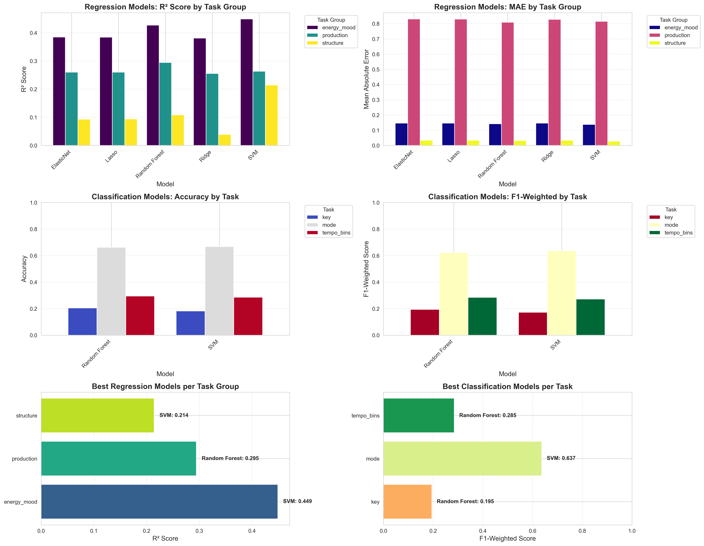
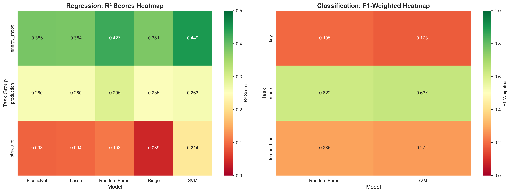
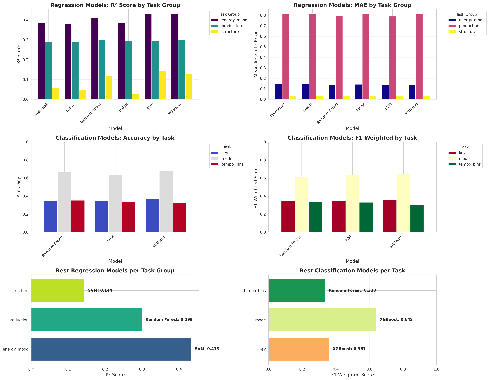
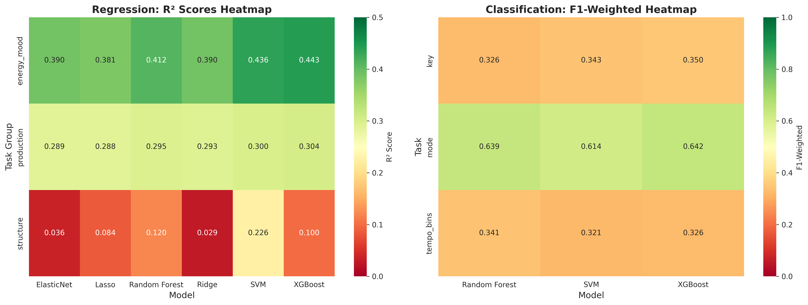

# Music Recommender System

## Overview

A content-based music recommendation system that leverages raw audio signal processing and machine learning to predict musical attributes and recommend acoustically similar tracks. Unlike traditional collaborative filtering approaches, this system analyzes the sonic characteristics of audio files directly, making it capable of providing recommendations for any audio input without requiring historical user interaction data.

The system processes raw audio through a comprehensive feature extraction pipeline, employs hybrid stacking ensemble models to predict multiple musical attributes, and utilizes cosine similarity in a high-dimensional feature space to identify and rank similar tracks from a large-scale music database.

## Motivation

Traditional music recommendation systems rely heavily on collaborative filtering, which requires extensive user interaction data and suffers from the cold-start problem. This project addresses these limitations by:

- Enabling recommendations based solely on audio content analysis
- Providing recommendations for novel tracks without prior user data
- Capturing nuanced acoustic similarities that may not be reflected in user behavior patterns
- Offering interpretable predictions of musical attributes that explain recommendation decisions

## Key Features

### Audio Processing Pipeline

- **Multi-format Support**: Accepts MP3, WAV, and M4A audio files
- **Dual Feature Extraction Pipelines**:
  - MFCC-based pipeline with delta and delta-delta coefficients
  - Comprehensive statistical features including spectral, temporal, rhythm, chroma, and harmonic characteristics
- **Intelligent Caching**: File-based caching system for extracted features to optimize repeated processing
- **Standardized Preprocessing**: Audio resampling, channel normalization, and duration standardization

### Machine Learning Architecture

- **Hybrid Stacking Ensemble**: Combines multiple algorithms (Random Forest, XGBoost, SVM, Ridge, Lasso, ElasticNet) via meta-learning
- **Multi-output Prediction**: Simultaneous prediction of 11 musical attributes grouped by correlation structure
- **Regression Tasks**: Energy, valence, danceability, loudness, acousticness, instrumentalness, liveness, speechiness
- **Classification Tasks**: Musical key (12 classes), mode (2 classes), tempo bins (6 classes)
- **Automated Model Selection**: Bayesian optimization for hyperparameter tuning with cross-validation

### Recommendation Engine

- **Content-Based Filtering**: Cosine similarity matching in normalized feature space
- **Scalable Architecture**: Vectorized operations for efficient similarity computation across large databases
- **Configurable Parameters**: Adjustable number of recommendations and feature weighting

### Production-Ready System

- **RESTful API**: FastAPI backend with automatic OpenAPI documentation
- **Web Interface**: Streamlit-based frontend with real-time audio upload and analysis
- **Containerized Deployment**: Docker and Docker Compose configuration for reproducible deployment
- **Health Monitoring**: Built-in health checks and logging infrastructure
- **Automated Training**: Self-contained training scripts with model persistence

## System Architecture

### Pipeline Components

```
Raw Audio Input
      ↓
[Audio Loader]
  - Format detection
  - Librosa loading (sr=22050 Hz)
  - Mono conversion
      ↓
[Spectrogram Extractor]
  - STFT computation (n_fft=2048, hop_length=512)
  - Mel spectrogram (n_mels=40)
  - 30-second normalization
      ↓
[Feature Extractor] (Two Variants)
  ├─ MFCC Pipeline
  │   - 13 MFCCs + Δ + ΔΔ
  │   - Statistical aggregation (mean, std, min, max, median, Q25, Q75)
  │   - Output: 273 features
  └─ Statistical Pipeline
      - Spectral features (centroid, bandwidth, rolloff, flatness, flux)
      - Temporal features (RMS, ZCR, attack time, centroid)
      - Rhythm features (tempo, beat strength, onset rate)
      - Chroma features (12 pitch classes)
      - Harmonic features (f0, tristimulus, inharmonicity)
      - HPSS separation
      - Output: 200+ features
      ↓
[Hybrid Model]
  - PCA dimensionality reduction (50 components)
  - Stacking ensemble per task group
  - Final estimators: Ridge (regression), Logistic Regression (classification)
      ↓
[Predicted Features]
  - 8 continuous attributes
  - 3 categorical attributes
      ↓
[Similarity Matching]
  - Feature standardization
  - One-hot encoding of categorical features
  - Cosine similarity computation
      ↓
[Ranked Recommendations]
```

## Technical Implementation

### Feature Extraction Details

#### MFCC Pipeline

The MFCC extraction pipeline computes Mel-Frequency Cepstral Coefficients with their first and second derivatives:

- **Base MFCCs**: 13 coefficients computed via discrete cosine transform of log-mel filterbank energies
- **Delta Coefficients**: First-order temporal derivatives capturing spectral change
- **Delta-Delta Coefficients**: Second-order derivatives representing acceleration of spectral change
- **Statistical Aggregation**: Seven statistical moments per coefficient (mean, standard deviation, minimum, maximum, median, 25th percentile, 75th percentile)
- **Total Features**: 13 × 3 × 7 = 273 features

#### Statistical Feature Pipeline

A comprehensive feature set capturing multiple aspects of audio signals:

**Spectral Features** (derived from STFT magnitude spectrogram):

- Spectral centroid: Center of mass of spectrum
- Spectral bandwidth: Spread around centroid
- Spectral rolloff: Frequency below which 85% of energy is concentrated
- Spectral flatness: Measure of tonality vs. noise
- Spectral flux: Rate of spectral change

**Temporal Features**:

- Root Mean Square (RMS) energy
- Zero Crossing Rate (ZCR)
- Attack time: Time to reach 90% of peak amplitude
- Temporal centroid: Center of mass in time domain

**Rhythm Features**:

- Tempo estimation via beat tracking
- Beat strength: Mean onset strength at detected beats
- Onset rate: Beats per second

**Chroma Features**:

- 12-dimensional pitch class profiles
- Captures harmonic content independent of octave

**Harmonic Features** (via Harmonic-Percussive Source Separation):

- Fundamental frequency (f0) statistics
- Tristimulus values: Relative energy in harmonics 1, 2-4, 5+
- Inharmonicity: Deviation from perfect harmonic ratios
- Harmonic-to-percussive energy ratio

### Model Architecture

#### Task Grouping Strategy

Musical attributes are grouped based on correlation structure to leverage multi-output learning:

**Regression Tasks**:

- Energy-Mood Group: energy, valence, danceability (R² = 0.45)
- Production Group: loudness, acousticness, instrumentalness, liveness (R² = 0.33)
- Structure Group: speechiness (R² = 0.22)

**Classification Tasks**:

- Key: 12 classes (F1-weighted = 0.37)
- Mode: 2 classes (major/minor) (F1-weighted = 0.68)
- Tempo Bins: 6 classes (F1-weighted = 0.34)

#### Stacking Ensemble Methodology

For each task group, the hybrid model employs a two-level stacking architecture:

**Level 0 (Base Models)**:

- Multiple diverse algorithms trained on the same data
- Each base model wrapped in preprocessing pipeline:
  - StandardScaler for feature normalization
  - PCA for dimensionality reduction (50 components)
- 5-fold cross-validation predictions used as meta-features

**Level 1 (Meta-Model)**:

- Ridge regression for continuous targets (alpha=1.0)
- Logistic regression for categorical targets (max_iter=5000)
- Trained on out-of-fold predictions from base models

**Multi-Output Handling**:

- Single-target groups: Direct stacking estimator
- Multi-target groups: MultiOutputRegressor/Classifier wrapper

#### Hyperparameter Optimization

Bayesian optimization via scikit-optimize for efficient hyperparameter search:

- Search space: Algorithm-specific parameter distributions
- Objective: Primary metric (R² for regression, F1-weighted for classification)
- Cross-validation: 5-fold stratified
- Iteration budget: 30-50 evaluations per model

### Recommendation Algorithm

The similarity computation follows this procedure:

1. **Feature Prediction**: Input audio → Predicted attributes via hybrid model
2. **Candidate Preparation**: Spotify database features (114,000+ tracks) preprocessed identically
3. **Feature Encoding**:
   - Continuous features: Z-score normalization
   - Categorical features: One-hot encoding with consistent schema
4. **Similarity Computation**: Cosine similarity between query vector and all candidates
5. **Ranking**: Top-N tracks selected by descending similarity score

Cosine similarity formula:

```
similarity(A, B) = (A · B) / (||A|| × ||B||)
```

where A is the query feature vector and B represents each candidate track.

## Model Performance

### Hybrid model Performance

| Task Type      | Group       | Targets                                            | Metric   | Score  |
| -------------- | ----------- | -------------------------------------------------- | -------- | ------ |
| Regression     | Energy-Mood | energy, valence, danceability                      | R²       | 0.4510 |
| Regression     | Production  | loudness, acousticness, instrumentalness, liveness | R²       | 0.3251 |
| Regression     | Structure   | speechiness                                        | R²       | 0.2234 |
| Classification | Key         | key                                                | Accuracy | 0.3613 |
| Classification | Mode        | mode                                               | Accuracy | 0.6821 |
| Classification | Tempo Bins  | tempo_bins                                         | Accuracy | 0.3613 |

### Performance Analysis

#### Regression Tasks Performance

**Energy-Mood Group (R² = 0.451)**

This group achieves the highest regression performance, explaining 45.1% of variance in energy, valence, and danceability. This strong performance is attributable to:

- High intercorrelation between these attributes (energetic music tends to be danceable and positive-valent)
- Multi-output learning exploiting shared acoustic patterns
- Clear acoustic signatures: rhythmic regularity for danceability, spectral energy for energy, harmonic consonance for valence
- Temporal features (beat strength, onset rate) providing strong predictive signals

The R² of 0.451 represents good performance for perceptual attributes, as these targets inherently contain subjective human judgment variance that cannot be fully captured from audio alone.

**Production Group (R² = 0.325)**

Moderate performance explaining 32.5% of variance in loudness, acousticness, instrumentalness, and liveness. Performance factors:

- Loudness prediction benefits from direct RMS energy correlation (likely highest individual R² within group)
- Acousticness and instrumentalness require distinguishing subtle timbral characteristics
- Liveness detection challenged by studio processing and crowd noise variability
- Heterogeneous target characteristics reduce multi-output learning synergy

The lower performance relative to Energy-Mood group reflects inherent task difficulty: production characteristics involve complex interactions between recording techniques, instrumentation, and venue acoustics that may not fully manifest in spectral features.

**Structure Group (R² = 0.223)**

Speechiness achieves modest 22.3% variance explanation. This limited performance is expected due to:

- Binary-like distribution in real data (most music has very low speechiness)
- Requirement for phonetic-level analysis not fully captured by aggregate spectral statistics
- Confusion between singing and speech in certain vocal styles
- Class imbalance effects (few high-speechiness tracks in training data)

Improved performance would likely require specialized features (e.g., formant tracking, phoneme detection) or deep learning approaches with attention mechanisms.

#### Classification Tasks Performance

**Mode Classification (Accuracy = 68.2%)**

Highest classification accuracy achieved for major/minor mode distinction. Strong performance explained by:

- Binary classification simplicity (only 2 classes vs. 6 or 12 for other tasks)
- Clear harmonic signatures: major thirds (4 semitones) vs. minor thirds (3 semitones) in chord structures
- Chroma feature effectiveness in capturing pitch class distributions
- Cultural pervasiveness of major/minor tonality in Western music corpus

The 68.2% accuracy represents 36.4% improvement over random baseline (50%), indicating genuine pattern learning. Remaining errors likely stem from:

- Modal mixture and borrowed chords in complex harmonic progressions
- Ambiguous tonality in certain genres (e.g., blues, jazz)
- Relative major/minor key confusion (same pitch classes, different tonal center)

**Key Classification (Accuracy = 36.1%)**

Low accuracy for 12-class key detection, only marginally above random baseline (8.3%). This challenging performance reflects fundamental limitations:

- High class imbalance: certain keys (C, G, D) overrepresented in popular music
- Transposition invariance: identical melodic/harmonic content in different keys
- Enharmonic equivalence confusion (e.g., F♯ major vs. G♭ major)
- Context dependency: key perception requires tonal hierarchy understanding beyond local features
- Limited training data per class (average 9,500 tracks per key if balanced)

Improved performance would require:

- Deep learning with attention to tonal hierarchy
- Longer audio context (beyond 30 seconds)
- Genre-specific key detection models
- Probabilistic key estimation rather than hard classification

**Tempo Bins Classification (Accuracy = 36.1%)**

Low accuracy for 6-class tempo categorization. Performance challenges include:

- Tempo ambiguity: half-time/double-time perceptual equivalence (60 BPM vs. 120 BPM)
- Metric structure complexity: compound vs. simple meters, syncopation
- Tempo range overlap between bins (boundary cases)
- Beat tracking errors propagating to tempo estimation

Notably, the identical accuracy to key classification (36.1%) suggests similar fundamental challenges in capturing hierarchical temporal structure from local features.

#### Pipelines comparison for single models:

- MFCC pipeline:
  
  
- Spectrogram pipeline:
  
  

## Installation

### Prerequisites

- Python 3.11 or higher
- Docker and Docker Compose (for containerized deployment)
- 8GB RAM minimum (16GB recommended for training)
- Storage: 5GB for models and dataset cache

### Local Installation

1. Clone the repository:

```bash
git clone https://github.com/Academic-Projects-2025/Music-recommendation-system.git
cd music-recommender
```

2. Install uv package manager (recommended):

```bash
curl -LsSf https://astral.sh/uv/install.sh | sh
```

3. Install dependencies:

```bash
uv sync --locked
```

4. Download the preprocessed dataset and models (if available):

```bash
# Dataset will be automatically downloaded on first run, docker will check if it exist, if not it will downloaded from the releases
# Or manually download from releases
```

Or just

```bash
chmod u+x setup.sh
./setup.sh
```

### Docker Deployment

1. Build and start services:

```bash
docker-compose up -d
```

2. Access the application:
   - Frontend: http://localhost:8501
   - Backend API: http://localhost:8000
   - API Documentation: http://localhost:8000/docs

3. Monitor logs:

```bash
docker-compose logs -f
```

4. Stop services:

```bash
docker-compose down
```

## Usage

### Web Interface

1. Navigate to http://localhost:8501
2. Upload an audio file (MP3, WAV, or M4A)
3. Adjust the number of desired recommendations
4. Click "Get Recommendations" to receive ranked similar tracks
5. Save favorites for later reference

### API Usage

#### Health Check

```bash
curl http://localhost:8000/health
```

#### Get Recommendations from Audio

```bash
curl -X POST "http://localhost:8000/recommend/from-audio?top_n=10" \
  -H "Content-Type: multipart/form-data" \
  -F "file=@path/to/audio.mp3"
```

Response format:

```json
{
  "recommendations": [
    {
      "name": "Track Name",
      "album": "Album Name",
      "artists": "Artist Name",
      "similarity_score": 0.95
    }
}
```

## Training Custom Models

### Data Requirements

The system expects a CSV file with the following columns:

- Track identifiers: `id`, `name`, `album`, `artists`
- Target features: `danceability`, `energy`, `loudness`, `speechiness`, `acousticness`, `instrumentalness`, `liveness`, `valence`, `key`, `mode`, `tempo`
- Audio file paths or streaming URLs

### Training Process

1. Prepare your dataset in the expected format
2. Update configuration in `src/music_recommender/config.py`
3. Run training script:

```bash
uv run -m src.music_recommender.scripts.training
```

For MFCC-based models:

```bash
uv run -m src.music_recommender.scripts.training_mfcc
```

### Training Configuration

Key parameters in model registry (`src/music_recommender/models/model_registry.py`):

- **N_ITER_CONFIG**: Number of Bayesian optimization iterations per model
- **TARGET_GROUPS**: Task grouping structure
- **MODEL_TEST**: Hyperparameter search spaces
- **SCORING_METRICS**: Evaluation metrics for cross-validation

Training generates:

- Performance reports: `models/model_comparison_results.csv`
- Final ensemble: `models/hybrid_model.joblib`

## Project Structure

```
music-recommender/
├── api/                          # Deprecated API location
├── data/
│   ├── raw/                      # Raw datasets
│   │   └── spotify-12m-songs/    # Spotify dataset
│   ├── processed/                # Processed feature matrices
│   └── interim/                  # Intermediate cached features
│       ├── spectrogram_cache/    # Cached spectrograms
│       ├── stats_feat/           # Cached statistical features
│       └── MFCC_cache/           # Cached MFCC features
├── docker/
│   ├── backend-entrypoint.sh     # Backend startup script
│   └── train-entrypoint.sh       # Training container entrypoint
├── docs/                         # Documentation
├── logs/                         # Application logs
├── models/                       # Trained models and metadata
│   ├── acousticness/
│   ├── danceability/
│   ├── energy/
│   ├── loudness/
│   ├── extraction_pipeline.joblib
│   ├── extraction_mfcc_pipeline.joblib
│   ├── hybrid_model.joblib
│   ├── mfcc_hybrid_model.joblib
│   └── *.csv                     # Model comparison reports
├── notebooks/                    # Jupyter notebooks for analysis
├── reports/                      # Generated analysis reports
├── src/
│   └── music_recommender/
│       ├── backend/
│       │   └── backend.py        # FastAPI application
│       ├── data/
│       │   ├── loaders.py        # Audio loading utilities
│       │   ├── extractors.py     # Feature extraction
│       │   ├── mfcc_extractor.py # MFCC extraction
│       │   ├── pipeline.py       # Pipeline construction
│       │   ├── dataset.py        # Dataset handling
│       │   └── reduction.py      # Dimensionality reduction
│       ├── evaluation/
│       │   ├── evaluator.py      # Model evaluation
│       │   └── visualizer.py     # Result visualization
│       ├── frontend/
│       │   ├── app.py            # Streamlit application
│       │   └── style.css         # UI styling
│       ├── models/
│       │   ├── hybrid.py         # Hybrid ensemble model
│       │   ├── mfcc_hybrid.py    # MFCC-specific ensemble
│       │   ├── recommender.py    # Recommendation engine
│       │   ├── MFCC_recommender.py
│       │   └── model_registry.py # Model configurations
│       ├── scripts/
│       │   ├── training.py       # Training orchestration
│       │   ├── training_mfcc.py  # MFCC training
│       │   ├── training_stats.py # Statistics training
│       │   └── visualize.py      # Visualization scripts
│       ├── training/
│       │   └── trainer.py        # Training logic
│       ├── utils/
│       │   ├── helpers.py        # Utility functions
│       │   └── logger.py         # Logging configuration
│       └── config.py             # Project configuration
├── tests/                        # Unit and integration tests
├── .dockerignore
├── .gitignore
├── docker-compose.yml            # Docker orchestration
├── Dockerfile.backend            # Backend container
├── Dockerfile.frontend           # Frontend container
├── pyproject.toml                # Project dependencies
├── uv.lock                       # Locked dependencies
└── README.md                     # This file
```

## Configuration

### Environment Variables

Backend configuration (`.env`):

```bash
GITHUB_RELEASE_URL=https://github.com/Academic-Projects-2025/Music-recommendation-system/releases/download/1.0/precessed_data.zip
```

### Configuration File

Edit `src/music_recommender/config.py`:

```python
class Config:
    paths = PathConfig(
        root=Path(__file__).parent.parent.parent,
        data=Path("data"),
        models=Path("models"),
        logs=Path("logs")
    )

    # Model parameters
    random_state = 42
    test_size = 0.2
    cv_folds = 5

    # Audio processing
    sample_rate = 22050
    n_fft = 2048
    hop_length = 512
    n_mels = 40
    n_mfcc = 13
```

## Dependencies

Core libraries:

- **Audio Processing**: librosa, soundfile
- **Machine Learning**: scikit-learn, xgboost, scikit-optimize
- **Web Framework**: FastAPI, Streamlit
- **Data Processing**: pandas, numpy
- **Visualization**: matplotlib, seaborn

See `pyproject.toml` for complete dependency list with versions.

## Dataset

The system is designed to work with the Spotify Million Song Dataset, which contains:

- 1.2M unique tracks
- Pre-computed Spotify audio features
- Metadata: track names, artists, albums
- Source: [Spotify Dataset](https://www.kaggle.com/datasets/rodolfofigueroa/spotify-12m-songs)

## Performance Optimization

### Caching Strategy

- Spectrogram computation cached to disk (NPZ format)
- Statistical features cached as pickled dictionaries
- MFCC features cached separately
- Cache invalidation based on parameter hash

### Computational Efficiency

- Vectorized similarity computation for batch processing
- PCA dimensionality reduction before model training
- Parallel processing in ensemble training (n_jobs=-1)
- Efficient sparse matrix operations for one-hot encoding

## Future Enhancements

### Short-term

- Implement user feedback loop for recommendation refinement
- Add explanation module for recommendation interpretability
- Support for playlist-level recommendations
- Audio fingerprinting for duplicate detection

### Medium-term

- Hybrid collaborative-content filtering
- Genre-aware recommendation weighting
- Multi-modal fusion with lyrics and metadata
- Real-time streaming audio analysis

### Long-term

- Deep learning end-to-end recommendation model
- Transfer learning from pre-trained audio models
- Multi-objective optimization for diversity-accuracy trade-off
- Federated learning for privacy-preserving personalization

## Acknowledgments

- Rodolfo Figueroa for providing the Million Song Dataset
- Michaël Defferrard for providing the FMA dataset.
- Librosa development team for audio processing tools
- scikit-learn community for machine learning infrastructure
- FastAPI and Streamlit teams for web framework support

## Citation

If you use this system in your research, please cite:

```bibtex
@software{music_recommender_2024,
  author = {Your Name},
  title = {Content-Based Music Recommendation System via Audio Signal Processing},
  year = {2024},
  url = {https://github.com/yourusername/music-recommender}
}
```
